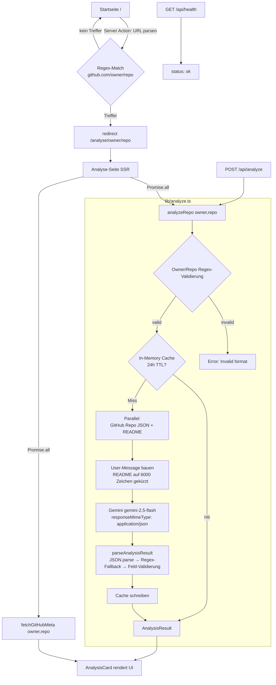

# What's in it? — Architektur & Ist-Stand

> Stand: 2026-06-04 · Analyse des aktuellen Codes (`whats-in-it/`)
> Zweck: Snapshot zum Analysieren des jetzigen Stands.

---

## 1. Was die App macht

**What's in it?** ist eine deutschsprachige Web-App, die ein beliebiges **GitHub-Repository in Sekunden einordnet**.

Ablauf für den Nutzer:
1. GitHub-URL einfügen (`https://github.com/owner/repo`)
2. App holt Repo-Metadaten + README über die GitHub-API
3. Schickt Daten an **Google Gemini** (`gemini-2.5-flash`)
4. Rendert strukturierte Analyse: Kategorie, Kern-Nutzen, Stars-Einordnung, Installationsbefehle, fertige KI-Prompts (Claude/Cursor), SEO-Deep-Dive (HTML), Sicherheits-Hinweis bei viralen Agenten.

Zusatz: Tech-Lexikon (`/wiki`) + Academy (`/lernen`).

---

## 2. Tech-Stack

| Bereich | Technologie | Version |
|---|---|---|
| Framework | Next.js (App Router) | 16.2.3 |
| UI | React | 19.2.4 |
| Sprache | TypeScript | ^5 |
| Styling | Tailwind CSS | ^4 (PostCSS) |
| LLM | Google Gemini `gemini-2.5-flash` | REST v1beta |
| Tests | Vitest | ^3.2.4 |
| Runtime | Node.js | >=20.9.0 |
| Deployment | Railway (NIXPACKS) | `output: standalone` |
| CI | GitHub Actions | lint + test + build |

**Keine DB. Kein externes SDK** — Gemini + GitHub werden per `fetch` direkt aufgerufen. Wiki/Academy/Lexikon sind hartkodiert im Code.

---

## 3. Verzeichnisstruktur

```
whats-in-it/
├── src/
│   ├── app/                          # Next.js App Router
│   │   ├── page.tsx                  # Startseite — URL-Eingabe (Server Action)
│   │   ├── layout.tsx                # Root-Layout (Header, Theme)
│   │   ├── globals.css               # Tailwind + globale Styles
│   │   ├── analyse/[owner]/[repo]/
│   │   │   ├── page.tsx              # SSR Analyse-Ergebnis
│   │   │   ├── loading.tsx           # Lade-Skeleton
│   │   │   ├── error.tsx             # Error-Boundary
│   │   │   └── not-found.tsx         # 404 (Repo existiert nicht)
│   │   ├── wiki/[begriff]/page.tsx   # Tech-Lexikon (WIKI-Konstante, 6 Einträge)
│   │   ├── lernen/page.tsx           # Academy-Übersicht (statisch)
│   │   └── api/
│   │       ├── analyze/route.ts      # POST — JSON-API um analyzeRepo()
│   │       └── health/route.ts       # GET — Railway Healthcheck
│   ├── components/                   # 5 Client-Components
│   │   ├── AnalysisCard.tsx          # Haupt-Renderer (237 LOC)
│   │   ├── Sidebar.tsx               # Inhaltsverzeichnis (sticky)
│   │   ├── HeaderSearch.tsx          # Such-Eingabe im Header
│   │   ├── CopyButton.tsx            # Copy-to-Clipboard
│   │   └── ThemeToggle.tsx           # Dark/Light Toggle
│   ├── lib/
│   │   ├── analyze.ts                # KERN: GitHub-Fetch + Gemini + Cache (214 LOC)
│   │   ├── analyze.test.ts           # Unit-Tests (Validierung + Parsing)
│   │   └── search-terms.ts           # Such-Index (Lexikon + Academy)
│   └── types/
│       └── analysis.ts               # AnalysisResult + GitHubRepo Interfaces
├── .github/workflows/ci.yml          # CI: lint → test → build
├── railway.json                      # Deploy-Config (Start + Healthcheck)
├── next.config.ts                    # standalone output + Image-Domains
├── .env.example                      # GEMINI_API_KEY (Pflicht), GITHUB_TOKEN (optional)
└── package.json
```

Gesamt-Code: **~1.667 LOC** (TS/TSX, ohne node_modules).

---

## 4. Request-Flow (Architektur)



### Kern-Schritte in `analyzeRepo()`
1. **Validierung** — `owner`/`repo` gegen `GITHUB_IDENTIFIER_RE` (verhindert Path-Traversal wie `../etc/passwd`).
2. **Cache-Check** — `Map<string, {data, ts}>`, 24h TTL. Hit = 0 Token-Kosten.
3. **Parallel-Fetch** — Repo-JSON + README (base64-dekodiert, auf 6000 Zeichen gekürzt). HTTP-Cache via `next: { revalidate: 3600 }`.
4. **Gemini-Call** — System-Prompt + User-Message, strikt JSON-Output (`maxOutputTokens: 8192`).
5. **Parsing** — `JSON.parse` → Fallback Regex `/{[\s\S]+}/` → Laufzeit-Validierung **jedes** Feldes gegen `AnalysisResult`.
6. **Cache schreiben** → zurückgeben.

---

## 5. Datenmodell

### `AnalysisResult` (LLM-Output, validiert)
```ts
{
  repoName: string
  starsInterpretation: string          // z.B. "Industriestandard" bei >10k
  category: string                     // Library|Framework|CLI|Agent|MCP|Design System|Template|Web App|Toolkit
  coreBenefit: string                  // 1 präziser Satz
  smartRecommendation: string | null   // NUR bei viralen autonomen Agenten (Security-Hinweis), sonst null (~95%)
  installation: { local, global, clone }
  aiPrompts: [{ intent, prompt }]      // 3 deutsche Prompts für Claude/Cursor
  seoDeepDiveHtml: string              // semantisches HTML, min. 300 Wörter
  keywordsForInternalLinking: string[] // 3-6 Begriffe für /wiki/-Verlinkung
}
```

### `GitHubRepo` (GitHub-API-Subset)
`full_name, description, stargazers_count, forks_count, language, topics, html_url, clone_url, homepage, license, updated_at, owner`

---

## 6. Routen-Übersicht

| Route | Typ | Zweck |
|---|---|---|
| `/` | SSR + Server Action | URL-Eingabe → redirect |
| `/analyse/[owner]/[repo]` | SSR | Analyse-Ergebnis (loading/error/not-found vorhanden) |
| `/wiki/[begriff]` | SSR | Tech-Lexikon (6 Einträge hartkodiert) |
| `/lernen` | Statisch | Academy-Übersicht |
| `POST /api/analyze` | API | JSON-API um `analyzeRepo()` mit Fehler-Mapping (400/404/429/500) |
| `GET /api/health` | API | Railway Healthcheck (`{status: ok}`) |

---

## 7. Konfiguration / Environment

| Variable | Pflicht | Wirkung |
|---|---|---|
| `GEMINI_API_KEY` | **Ja** | Gemini-Aufruf; ohne → Fehler |
| `GITHUB_TOKEN` | Empfohlen | GitHub Rate-Limit 60 → 5000 req/h |

⚠️ **Doku-Inkonsistenz (bekannt):** `.env.local.example` + README erwähnen teils `ANTHROPIC_API_KEY`/Claude — **veraltet**. Der Live-Code (`src/lib/analyze.ts`) nutzt **Gemini**. `.env.example` ist die korrekte Quelle.

---

## 8. Kritische Kopplungen (beim Ändern beachten)

Drei Stellen müssen **synchron** bleiben, sonst bricht die Pipeline:
1. JSON-Schema im `SYSTEM_PROMPT` (`src/lib/analyze.ts`)
2. `AnalysisResult` Interface (`src/types/analysis.ts`)
3. Validator `parseAnalysisResult()` (`src/lib/analyze.ts`)

**Kategorie hinzufügen** = 2 Touchpoints: `SYSTEM_PROMPT` (Enum) + `CATEGORY_COLORS` (Badge-Farben in `AnalysisCard.tsx`).

**Security-Notiz:** `AnalysisCard` rendert `seoDeepDiveHtml` per `dangerouslySetInnerHTML` — LLM-generiertes HTML ungefiltert. XSS-Risiko, falls Modell-Output kompromittiert.

---

## 9. Reife-Bewertung (Ist-Stand)

**Stärken**
- Saubere Trennung: Kern-Logik (`lib/analyze.ts`) entkoppelt von UI.
- Eingabe-Validierung am Boundary (Regex gegen Path-Traversal).
- Strikte LLM-Output-Validierung mit Fallbacks.
- CI vorhanden (lint + test + build), Tests für Validierung/Parsing.
- Production-ready Deployment (Railway, standalone, Healthcheck, Restart-Policy).
- Kosten-Optimierung: 24h-Cache + HTTP-Revalidate.

**Schwächen / Tech-Debt**
| Thema | Risiko | Hinweis |
|---|---|---|
| In-Memory Cache | Mittel | Nur Single-Instance. Horizontal skalieren → Redis/Vercel KV nötig. |
| `dangerouslySetInnerHTML` | Mittel | LLM-HTML ungefiltert (XSS). Sanitizing erwägen. |
| Doku veraltet | Niedrig | Anthropic/Gemini-Mismatch in README/.env.local.example. |
| Test-Abdeckung | Niedrig | Nur `lib/analyze` getestet; keine Component-/E2E-Tests. |
| Kein Rate-Limiting | Mittel | `/api/analyze` offen — Missbrauch verursacht Gemini-Kosten. |
| Wiki/Academy hartkodiert | Niedrig | Skaliert nicht ohne CMS/DB. |

---

## 10. Kurz-Fazit

Schlanke, fokussierte Next.js-16-App mit einer klaren Aufgabe: **GitHub-Repos KI-gestützt einordnen**. Architektur sauber und deploybar. Haupt-Reibungspunkte für Wachstum: persistenter Cache, Rate-Limiting auf der API und HTML-Sanitizing. Doku-Inkonsistenz (Anthropic vs. Gemini) sollte bereinigt werden.
