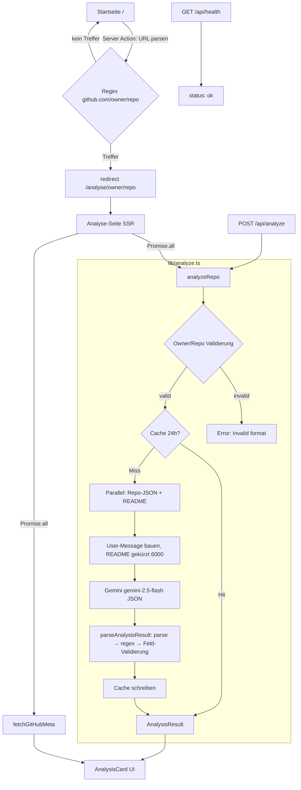

# PRD — What's in it?

> **Product Requirements Document (Reverse-Engineered / Ist-Stand)**
> Version: 1.0 · Stand: 2026-06-04 · Status: Beschreibt den **aktuell implementierten** Stand
> Scope: `whats-in-it/` (Next.js 16 Web-App)
> Verwandt: [`ARCHITECTURE.md`](./ARCHITECTURE.md)

---

## 1. Übersicht

### 1.1 Produkt
**What's in it?** ist eine deutschsprachige Web-App, die ein beliebiges öffentliches GitHub-Repository per KI in Sekunden einordnet. Nutzer fügt eine GitHub-URL ein und erhält eine strukturierte Entscheidungshilfe statt roher Repo-Daten.

### 1.2 Problem
Open Source ist mächtig, aber unübersichtlich. Entwickler verlieren Zeit beim Bewerten neuer Tools: README lesen, Kategorie erraten, Installation suchen, Risiken einschätzen. Der Sprung von „klingt interessant" zu „nutze ich" dauert zu lange.

### 1.3 Lösung
KI-gestützte Sofort-Analyse: Kategorie, Kern-Nutzen, Stars-Einordnung, Installationsbefehle, fertige Copy-Paste-Prompts für Claude/Cursor, SEO-Deep-Dive und ein Sicherheits-Hinweis bei riskanten autonomen Agenten.

### 1.4 Zielnutzer
- Entwickler, die schnell neue Tools/Libraries bewerten wollen
- Tech-Entscheider beim Tool-Scouting
- Einsteiger-bis-Senior beim Verstehen unbekannter Repos (Ansprache bewusst auf Augenhöhe, kein „Anfänger"-Vokabular)

### 1.5 Produktversprechen
Weniger Suchzeit, mehr Umsetzungszeit. Open Source nicht nur *finden*, sondern schnell *verstehen* und sicher *einsetzen*.

---

## 2. Ziele & Nicht-Ziele

### 2.1 Ziele (aktuell umgesetzt)
- G1: GitHub-URL → strukturierte Analyse in einem Schritt
- G2: Fertige KI-Prompts zur direkten Weiterverarbeitung
- G3: Kosten-effizient durch Caching (keine doppelten LLM-Calls)
- G4: Production-deploybar (Railway, Healthcheck)
- G5: Deutschsprachige, vertrauenswürdige Aufbereitung

### 2.2 Nicht-Ziele (aktuell bewusst NICHT enthalten)
- N1: Nutzer-Accounts / Auth
- N2: Persistente Datenbank / History
- N3: Private Repos (nur öffentliche GitHub-API ohne User-Auth)
- N4: Mehrsprachigkeit (nur Deutsch)
- N5: Horizontale Skalierung (Cache ist In-Memory, Single-Instance)

---

## 3. Funktionale Anforderungen (Ist-Stand)

| ID | Feature | Status | Quelle |
|---|---|---|---|
| FR-1 | URL-Eingabe auf Startseite, Parsing per Regex, Redirect zur Analyse | ✅ | `src/app/page.tsx` |
| FR-2 | SSR-Analyse-Seite unter `/analyse/[owner]/[repo]` | ✅ | `src/app/analyse/.../page.tsx` |
| FR-3 | GitHub-Metadaten abrufen (Stars, Sprache, Topics, Lizenz, Owner) | ✅ | `lib/analyze.ts:fetchGitHubData` |
| FR-4 | README abrufen, base64-dekodieren, auf 6000 Zeichen kürzen | ✅ | `lib/analyze.ts:fetchReadme` |
| FR-5 | LLM-Analyse via Gemini `gemini-2.5-flash`, strikt JSON | ✅ | `lib/analyze.ts:analyzeRepo` |
| FR-6 | Strikte Validierung jedes LLM-Output-Feldes | ✅ | `lib/analyze.ts:parseAnalysisResult` |
| FR-7 | 24h In-Memory-Cache pro `owner/repo` | ✅ | `lib/analyze.ts` |
| FR-8 | Ergebnis-UI: Kategorie-Badge, Nutzen, Install, Prompts, SEO-HTML | ✅ | `components/AnalysisCard.tsx` |
| FR-9 | Sicherheits-Hinweis (`smartRecommendation`) nur bei viralen autonomen Agenten | ✅ | `SYSTEM_PROMPT` |
| FR-10 | JSON-API `POST /api/analyze` mit Fehler-Mapping (400/404/429/500) | ✅ | `api/analyze/route.ts` |
| FR-11 | Healthcheck `GET /api/health` | ✅ | `api/health/route.ts` |
| FR-12 | Tech-Lexikon `/wiki/[begriff]` (6 Einträge, hartkodiert) | ✅ | `app/wiki/[begriff]/page.tsx` |
| FR-13 | Academy-Übersicht `/lernen` (statisch) | ✅ | `app/lernen/page.tsx` |
| FR-14 | Header-Suche über Lexikon/Academy-Begriffe | ✅ | `components/HeaderSearch.tsx` + `lib/search-terms.ts` |
| FR-15 | Dark/Light Theme-Toggle | ✅ | `components/ThemeToggle.tsx` |
| FR-16 | Copy-to-Clipboard für Befehle/Prompts | ✅ | `components/CopyButton.tsx` |
| FR-17 | Lade-/Fehler-/404-States für Analyse-Route | ✅ | `loading/error/not-found.tsx` |
| FR-18 | Eingabe-Validierung gegen Path-Traversal (Regex) | ✅ | `isValidGitHubIdentifier` |

---

## 4. Nicht-funktionale Anforderungen (Ist-Stand)

| ID | Bereich | Anforderung | Status |
|---|---|---|---|
| NFR-1 | Performance | Cache-Hit = 0 LLM-Token; GitHub-HTTP-Cache 1h (`revalidate: 3600`) | ✅ |
| NFR-2 | Kosten | Doppelte Analysen werden 24h aus Cache bedient | ✅ |
| NFR-3 | Sicherheit | Owner/Repo-Validierung verhindert Path-Traversal | ✅ |
| NFR-4 | Sicherheit | `seoDeepDiveHtml` per `dangerouslySetInnerHTML` — **ungefiltert (XSS-Risiko)** | ⚠️ offen |
| NFR-5 | Sicherheit | Kein Rate-Limiting auf `/api/analyze` | ⚠️ offen |
| NFR-6 | Skalierung | In-Memory-Cache nur Single-Instance | ⚠️ Limit |
| NFR-7 | Robustheit | LLM-Output mehrstufig validiert (parse → regex → Feld-Check) | ✅ |
| NFR-8 | Betrieb | Railway Restart-Policy `ON_FAILURE`, max 10 Retries | ✅ |
| NFR-9 | Qualität | CI: Lint + Unit-Test + Build bei jedem Push/PR | ✅ |
| NFR-10 | Sprache | Alle UI-Strings, System-Prompt, generierte Prompts auf Deutsch | ✅ |

---

## 5. Tech-Stack

| Bereich | Technologie | Version |
|---|---|---|
| Framework | Next.js (App Router) | 16.2.3 |
| UI-Bibliothek | React | 19.2.4 |
| Sprache | TypeScript | ^5 |
| Styling | Tailwind CSS (PostCSS) | ^4 |
| LLM | Google Gemini `gemini-2.5-flash` (REST v1beta) | — |
| Datenquelle | GitHub REST API | — |
| Tests | Vitest | ^3.2.4 |
| Runtime | Node.js | >=20.9.0 |
| Deployment | Railway (NIXPACKS, `output: standalone`) | — |
| CI | GitHub Actions | — |

**Keine DB, kein LLM-SDK** — Gemini + GitHub via nativem `fetch`.

---

## 6. Architektur

### 6.1 Request-Flow



### 6.2 Schichten
- **Präsentation:** App-Router-Seiten (SSR) + 5 Client-Components
- **Kern-Logik:** `src/lib/analyze.ts` — entkoppelt von UI, einziger Ort für GitHub+Gemini+Cache
- **Verträge:** `src/types/analysis.ts` (`AnalysisResult`, `GitHubRepo`)
- **API:** `/api/analyze` (JSON), `/api/health` (Healthcheck)

### 6.3 Verzeichnisstruktur
```
whats-in-it/
├── src/
│   ├── app/
│   │   ├── page.tsx                  # Startseite (Server Action)
│   │   ├── layout.tsx                # Root-Layout
│   │   ├── globals.css
│   │   ├── analyse/[owner]/[repo]/   # page + loading + error + not-found
│   │   ├── wiki/[begriff]/page.tsx   # Lexikon (6 Einträge)
│   │   ├── lernen/page.tsx           # Academy (statisch)
│   │   └── api/analyze + api/health
│   ├── components/                   # AnalysisCard, Sidebar, HeaderSearch, CopyButton, ThemeToggle
│   ├── lib/                          # analyze.ts (Kern), analyze.test.ts, search-terms.ts
│   └── types/analysis.ts
├── .github/workflows/ci.yml
├── railway.json · next.config.ts · .env.example · package.json
└── docs/  (PRD.md, ARCHITECTURE.md)
```
Code-Umfang: **~1.667 LOC** (TS/TSX).

---

## 7. Datenmodell

### 7.1 `AnalysisResult` (validierter LLM-Output)
```ts
{
  repoName: string
  starsInterpretation: string          // z.B. "Industriestandard" (>10k), "Wächst schnell" (>1k)
  category: string                     // Library|Framework|CLI|Agent|MCP|Design System|Template|Web App|Toolkit
  coreBenefit: string                  // 1 präziser Satz
  smartRecommendation: string | null   // nur bei viralen autonomen Agenten; sonst null (~95%)
  installation: { local: string|null, global: string|null, clone: string }
  aiPrompts: Array<{ intent: string, prompt: string }>   // 3 deutsche Prompts
  seoDeepDiveHtml: string              // semantisches HTML, min. 300 Wörter
  keywordsForInternalLinking: string[] // 3-6 Begriffe → /wiki/
}
```

### 7.2 `GitHubRepo` (GitHub-API-Subset)
`full_name, description, stargazers_count, forks_count, language, topics, html_url, clone_url, homepage, license, updated_at, owner{login, avatar_url}`

---

## 8. API-Spezifikation

### `POST /api/analyze`
**Body:** `{ owner: string, repo: string }`
**200:** `AnalysisResult`
**Fehler:** 400 (ungültiges Format / fehlende Felder), 404 (Repo nicht gefunden), 429 (GitHub Rate-Limit), 500 (LLM-Fehler / fehlender Key)

### `GET /api/health`
**200:** `{ status: "ok", timestamp: ISO8601 }`

---

## 9. Konfiguration / Environment

| Variable | Pflicht | Wirkung |
|---|---|---|
| `GEMINI_API_KEY` | **Ja** | Gemini-Aufruf; fehlt → 500 |
| `GITHUB_TOKEN` | Empfohlen | GitHub Rate-Limit 60 → 5000 req/h |

⚠️ **Bekannte Doku-Inkonsistenz:** `.env.local.example` + README erwähnen teils `ANTHROPIC_API_KEY`/Claude — **veraltet**. Live-Code nutzt Gemini. `.env.example` = korrekte Quelle.

---

## 10. Kritische Kopplungen (Pflege-Hinweise)

**Müssen synchron bleiben (sonst bricht Pipeline):**
1. JSON-Schema in `SYSTEM_PROMPT` (`lib/analyze.ts`)
2. `AnalysisResult` (`types/analysis.ts`)
3. Validator `parseAnalysisResult()` (`lib/analyze.ts`)

**Neue Kategorie = 2 Touchpoints:** `SYSTEM_PROMPT`-Enum + `CATEGORY_COLORS` in `AnalysisCard.tsx`.
**Neuer Wiki-Eintrag:** `WIKI`-Konstante in `wiki/[begriff]/page.tsx` (keine DB).

---

## 11. Bekannte Limitierungen / Tech-Debt

| ID | Thema | Risiko | Empfehlung |
|---|---|---|---|
| TD-1 | In-Memory-Cache (Single-Instance) | Mittel | Redis/Vercel KV bei horizontaler Skalierung |
| TD-2 | `dangerouslySetInnerHTML` für LLM-HTML | Mittel (XSS) | HTML sanitizen (z.B. DOMPurify/sanitize-html) |
| TD-3 | Kein Rate-Limiting auf `/api/analyze` | Mittel (Kosten) | IP-/Token-Bucket-Limiter |
| TD-4 | Doku Anthropic vs. Gemini | Niedrig | README/.env.local.example bereinigen |
| TD-5 | Test-Abdeckung nur `lib/analyze` | Niedrig | Component-/E2E-Tests ergänzen |
| TD-6 | Wiki/Academy hartkodiert | Niedrig | CMS/DB bei Wachstum |

---

## 12. Roadmap-Kandidaten (Vorschlag, nicht umgesetzt)

- R1: HTML-Sanitizing für `seoDeepDiveHtml` (Security, hoher Impact/wenig Aufwand)
- R2: Rate-Limiting auf API (Kostenschutz)
- R3: Persistenter Cache (Redis) für Skalierung
- R4: Doku-Konsolidierung (Gemini einheitlich)
- R5: Erweiterte Test-Abdeckung (Components + E2E)
- R6: Wiki/Academy datengetrieben statt hartkodiert

---

## 13. Erfolgskriterien (Ist-Bewertung)

| Kriterium | Stand |
|---|---|
| URL → Analyse funktioniert end-to-end | ✅ |
| Deploybar auf Railway mit Healthcheck | ✅ |
| CI grün (Lint/Test/Build) | ✅ |
| Kosten durch Cache reduziert | ✅ |
| Sicher für öffentliche Nutzung (Rate-Limit + Sanitizing) | ⚠️ offen (TD-2, TD-3) |

---

*Dieses PRD beschreibt den implementierten Ist-Stand. Geplante Features sind als Roadmap-Kandidaten markiert und nicht Teil des aktuellen Codes.*
